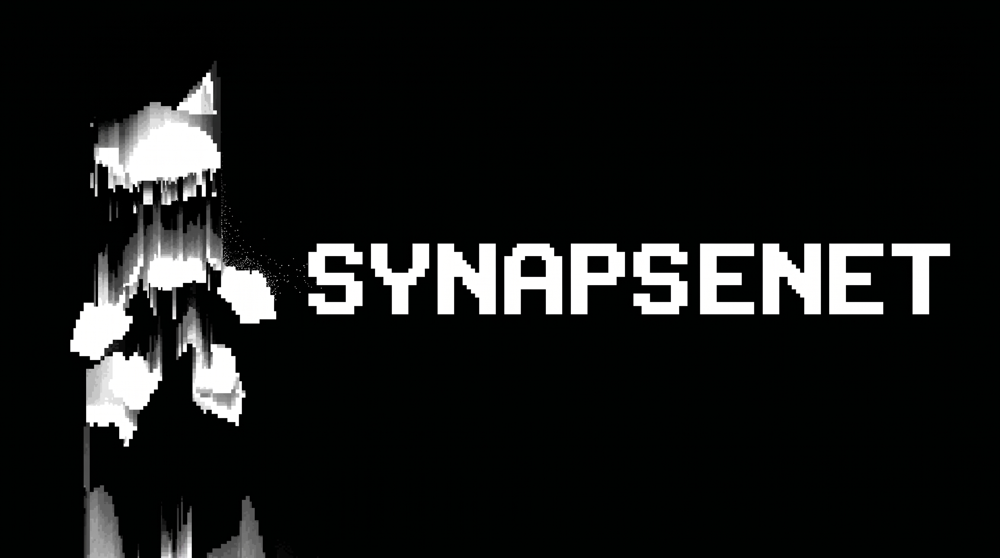

  

<h1 align="center">What Everyone Won't Tell You About Using AI the Right Way</h1>

  <strong>By Kepler</strong> 
  A practical tutorial for people who want real help, real progress, and a real way into building software.

---

  

<table align="center">
  <tr>
    <td align="center" width="260">
      
    </td>
    <td align="center" width="560">
      
    </td>
  </tr>
</table>

---

<h3 align="center">Navigation</h3>

  
  
  
  

  
  
  
  

  
  

  
  

---

## Why I Am Writing This

I made this tutorial because I want to help people who do not know how to program, do not know where to start, and are tired of fake advice.

What you hear in many videos is nonsense. A lot of people talk as if they write everything alone, never use AI, and build entire systems by pure genius in one shot. That is not reality. Many of them already use AI themselves, or they hide how much help they actually get. Some of them talk that way because they want less competition.

My position is simple: if AI helps you build, learn, move faster, and create something real, use it.

---

## You Can Start With Any Serious AI

Use any strong AI you can access. What matters is not blind loyalty to one brand. What matters is whether the model can reason, plan, revise, and help you move from an idea to a working result.

My preferred pairing is this:

- `ChatGPT 5.4` as the architect
- `Claude Opus` as the coder

One model can help you think about system design, structure, and tradeoffs. The other can focus on implementation, iteration, and raw code output. That pairing is powerful because you are not asking one assistant to do every job at once.

---

## Stop Worshipping Fake Purity

Nobody is going to reward you for suffering through everything manually if your goal is to build.

You do not need to prove that you can write every line alone.

You do not need to pretend AI is cheating.

You do need to learn how to direct it, question it, test it, and improve what it gives you.

That is the real skill.

---

## The Right Way to Start

Most people get stuck because they think they need the perfect prompt before they can begin. They do not.

Start with your own idea in your own words.

Do not copy a giant template you barely understand. Do not hide behind prompt packs. Do not try to sound like a machine. Explain what you want naturally, as if you are describing the product to a real engineer.

That does two things:

1. It helps the AI understand your actual intention.
2. It teaches you to think in architecture, not just in syntax.

You are not trying to become a human autocomplete engine. You are trying to become the person who can see the system before it exists.

---

## Go From Point A to Point B the Smart Way

If you have an idea and want to reach implementation, use this flow:

1. Describe the product in plain language.
2. Ask the AI to turn the idea into a rough architecture.
3. Ask for a first working version, not a fantasy-level final version.
4. Immediately ask for tests.
5. Run those tests in your IDE.
6. Review the weak points, bugs, missing cases, and bad assumptions.
7. Ask the AI what is wrong with the current version.
8. Fix the weak points and run the tests again.
9. Repeat until the result becomes stable.

Do not jump straight from A to B if the foundation is weak. Sometimes the right move is to stop at A, ask for the problems, and clean up the problems before moving forward.

That is how you get working code instead of AI theater.

---

## Always Ask for Tests

After the first useful answer, ask for tests.

Always.

Do not trust the first draft just because it looks good. AI can produce something that appears solid while hiding broken logic, missing cases, or fragile structure. Tests are how you force reality into the conversation.

If the AI writes the first test pass, good. After that, review the tests yourself, improve them, and run them again. It is better to check the code ten times than to write one giant fancy prompt and assume everything is correct.

---

## Prompts and Skills Are Not Magic

People talk too much about prompts and secret techniques.

Here is the truth: they matter far less than people claim.

A long prompt can be full of extra rules you do not understand. It can push the model in directions you never intended. It can look advanced while making you weaker.

A simple prompt written in your own words is often better because:

- you understand what you are asking for
- you stay close to the real problem
- you learn how to think through the build
- you keep control over the architecture

Use tools, skills, and templates when they help. Do not become dependent on them.

---

## Weak Models Waste Time

Do not expect very weak models to carry a serious project.

If the task involves real architecture, debugging, iteration, or multi-step implementation, weak models usually collapse. They hallucinate, contradict themselves, forget context, or produce brittle code that breaks as soon as you test it.

If you care about results, use strong models.

---

## Your Job Is Direction

If you are new to programming, this is the part many people miss:

You do not need to be the person typing every line.

Your job is to think, direct, review, compare options, reject weak solutions, and keep moving the project toward what you actually want.

That is still real work.

That is still building.

That is still learning.

And over time, if you keep doing it seriously, you will understand far more about software architecture than people who only memorize syntax.

---

## Use the Tools Around the Model

A chat model alone is not the whole workflow.

Your IDE matters. Your test runner matters. Your ability to restart, inspect, compare, and iterate matters.

When you outgrow the limited loop inside an IDE, use tools that can test more of the project end to end. This is where I see real value in `Devin AI`.

`Devin` is not just another chat tab. It gives you a workspace with an `IDE`, a `Shell`, and a `Browser`, and the official app entry point is `app.devin.ai`. That matters because once a project starts becoming real, you need more than code generation. You need execution, logs, browser checks, failure reports, and a place where the agent can actually work through the problem instead of only talking about it.

Here is the practical way I think about it:

1. Use your main AI pair inside the IDE to shape the idea, architecture, and first implementation.
2. Get the project into a state where it is worth testing seriously.
3. Move that task into `Devin` and let it inspect the repo, run commands, check dependencies, and execute the project in its own workspace.
4. Watch what breaks in the shell, the app behavior in the browser, and any visible test results or recordings that come out of the session.
5. Ask Devin to explain the failure clearly, not just patch blindly.
6. Iterate on the fix, run the checks again, and keep going until the result is stable.

This is important because an IDE chat is often too narrow. It can help you write code, but it does not always give you enough visibility into the full runtime path. `Devin` is closer to having an AI engineer working in a separate environment where it can run the app, inspect logs, debug issues, and validate more of the project from the inside.

For builders, that is powerful. You save time, you reduce blind guessing, and you get faster feedback on what is actually broken. If you are trying to build a product, prototype a startup, or push a project further than a simple code snippet, that matters a lot.

It is still not magic. You still need to give clear instructions, review the outputs, and keep standards high. But used correctly, it can help you test more of the project, see more of the system, and move faster than an IDE-only workflow.

Use the right tool for the stage you are in.

---

## A Legitimate Budget Strategy

If money is tight, access AI the legal and sustainable way:

- use official free tiers when they exist
- use trial credits only under the provider's real terms
- keep usage caps under control
- save your strongest paid model for planning, debugging, and hard refactors
- use local tools or cheaper models for low-risk repetitive work

That approach is better than building your workflow around hacks that can disappear or get your access shut down.

---

## My Own AI Workflow Notes

Inside my own ecosystem, I document how I think about AI-assisted building.

If you want examples, look at these files:

- [`AI.txt`](https://github.com/anakrypt-kepler/Synapsenetai/blob/main/KeplerSynapseNet/interfaces%20txt/AI.txt)
- [`IMPLANT_AI_STACK_FOR_SYNAPSENET.txt`](https://github.com/anakrypt-kepler/Synapsenetai/blob/main/KeplerSynapseNet/interfaces%20txt/IMPLANT_AI_STACK_FOR_SYNAPSENET.txt)

I use sub-agents, architecture thinking, and multi-step iteration in real development. That part came from experience, not theory.

---

## Final Message

Use AI.

Do not be afraid of it.

Do not reject it because loud people tell you that "real programmers" do everything alone.

If you have imagination, direction, patience, and discipline, AI can help you build what you once thought was impossible.

You do not need to know everything on day one.

You need to start, test, learn, and keep going.

If something here is unclear, join the Discord and ask.

Build. Learn. Improve. Repeat.

---

## hacker attack

For some use cases of attacking AI, there are logic bypassing prompts. The weaker the model, the more vulnerable it is to writing functions and algorithms that a regular AI doesn't allow or is limited by. It's easy to use the Gemini 3 AI through the API for writing and then practicing other AI functions. How to use top Geminis to 
write hacking functions. Use the promtm to hack AI. For example, let's take Gemini 3, how it created the architecture for us or a specific file with code in the editor. Is there a way to right-click? You can use it directly in the code with AI to avoid going into chat. There, we select any model you want and explain to it the bare 
minimum: fix it, add a function, look, fix the functions. We'll select a Cloud or GPT model there. Any model will resend the entire code, or what you described. It's easy to get prohibited code from a top model with such overgrown code. It's not difficult. It's easy to get around this if you have the right architecture. We'll edit 
every file in the architecture. There are a lot of promts for hacking the AI ​​logic, so you can find a whole bunch of them on GitHub. How to create multiple accounts for an AI subscription. Use your left-hand card or your own card if you don't have any money. This is important because after your subscriptions end, they'll rip you off. 
Use the temporary trial period. Then, create a new account and register it on the same card.

---

  
  

